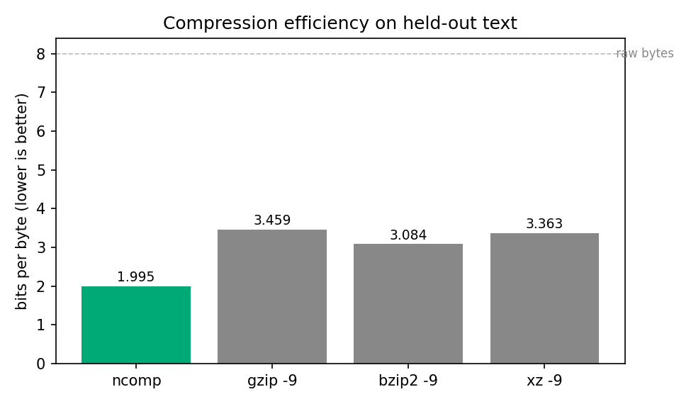
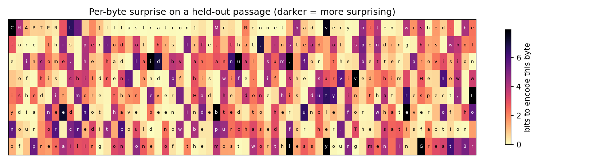

# Benchmark

_Generated by `scripts/benchmark.py` on 2026-05-23 23:13:11 UTC (CPython 3.12.13 on arm64)._

## Headline

Neural Compressor encodes the held-out chunk in **1.995 bits per byte**, versus **3.459** for gzip -9; the resulting file is **42.3% smaller** than gzip's. It also beats bzip2 -9 (3.084 bits/byte) on this text. It also beats xz -9 (3.363 bits/byte) on this text.

This costs roughly **31840x** the wall-clock time of gzip (12.1s vs 0.4ms to compress).

## Setup

* Input: first **16,384 bytes** of the held-out test split of Pride and Prejudice (text the model never saw during training).
* Reference cross-entropy on held-out at training time: **2.0221 bits/byte**.
* Standard tools: Python's stdlib `gzip`, `bz2`, and `lzma`, all at their highest preset (`-9`).
* Neural Compressor: the bundled `models/checkpoint.pt` (~430k-parameter byte-level Transformer) with the default coding settings.
* All timings are wall-clock on a single CPU; round-trip equality is asserted on every entry below.

## Results

```
tool      compressed  ratio   bits/byte  compress  decompress  ok 
----      ----------  -----   ---------  --------  ----------  -- 
ncomp     4,086       0.2494  1.9951     12.05s    12.51s      yes
gzip -9   7,084       0.4324  3.4590     0.00s     0.00s       yes
bzip2 -9  6,317       0.3856  3.0845     0.00s     0.00s       yes
xz -9     6,888       0.4204  3.3633     0.01s     0.00s       yes
```



## Per-byte surprise

The figure below shows how many bits the model spent on each byte of a short passage from the held-out text. Common characters and well-predicted spelling are pale (low surprise); unusual words, sentence boundaries, and rare characters are dark (high surprise).



Passage shown (first ~60 characters):

```
CHAPTER L.\n \n [Illustration]\n \n Mr. Bennet had very often wished
```

## Reading the numbers

Lower bits-per-byte means the file shrinks more. Eight bits per byte is the uncompressed baseline (one byte stays one byte). gzip and friends approach the information-theoretic limit for fixed-window dictionary codes; a probability model that anticipates English orthography and grammar can squeeze further, and that is exactly what Neural Compressor demonstrates on this corpus.

Speed, on the other hand, is the cost: the standard tools run a tight C loop, whereas Neural Compressor runs a transformer forward pass for every byte. This asymmetry is the headline tradeoff and is shown above in the timing columns.

## Limitations

* The model was trained on a single book; on out-of-domain text (source code, log files, foreign languages) the ratio will degrade towards gzip's territory.
* The benchmark chunk is a deliberate slice (default 16 KB) to keep the run under a few minutes on CPU; rerun with `--bytes 65536` (or more) for larger numbers.
* Times include Python overhead and per-token PyTorch dispatch; an optimised C++/CUDA implementation would close some of the speed gap but not all of it.
