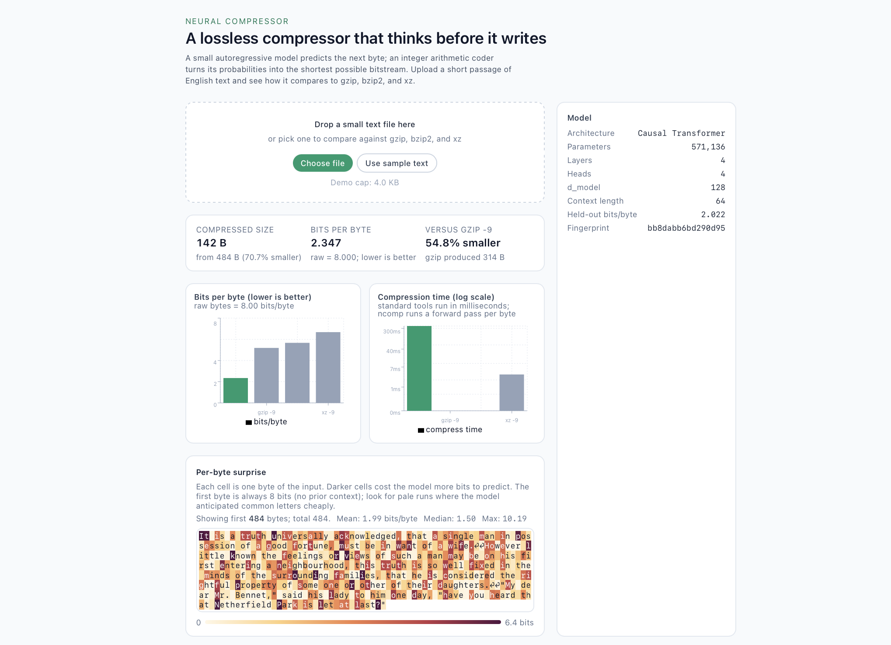
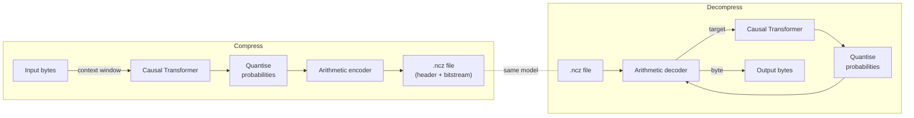

# Neural Compressor

[](https://github.com/joshuacowellcay/neural-compressor/actions/workflows/ci.yml)
[](LICENSE)
[](https://www.python.org)

A lossless data compressor built from a small neural network and an integer-arithmetic
entropy coder. A causal Transformer predicts the next byte, an arithmetic coder turns those
probabilities into the shortest possible bitstream, and decompression runs the identical
model in lockstep to reconstruct the original bytes exactly.

## Demo



Drop a short passage into the web app and you get the head-to-head comparison
against gzip, bzip2, and xz, the per-byte "surprise" heatmap (each cell is one byte,
darker = more bits to predict), and the model metadata sidebar. The screenshot
above is a 484-byte sample from the bundled corpus.

To run it locally see [Setup](#setup-under-five-minutes-from-a-fresh-clone) below.

## Headline results

Measured on 16 KiB of held-out *Pride and Prejudice* (the model never saw this text during
training). Numbers regenerate from a real run of `python scripts/benchmark.py`; see
[BENCHMARK.md](BENCHMARK.md) for the full table.

| Tool                | Bits per byte | Compressed bytes | vs. gzip                |
| ------------------- | ------------- | ---------------- | ----------------------- |
| **Neural Compressor** | **1.995**   | **4,086**        | **42% smaller**         |
| gzip -9             | 3.459         | 7,084            | reference               |
| bzip2 -9            | 3.085         | 6,317            | 35% smaller             |
| xz -9               | 3.363         | 6,888            | 41% smaller             |


The neural compressor wins on size and loses on speed: a single forward pass of the small
Transformer runs per byte, so compressing 16 KiB takes roughly twelve seconds against gzip's
half a millisecond. That tradeoff is the headline of the project, not a bug.

## Why a neural network compresses

Shannon's source coding theorem says the shortest lossless encoding of a symbol with
probability `p` takes `-log2(p)` bits. Arithmetic coding achieves that bound to within a
fraction of a bit, **whatever** probability model you give it. The model is therefore the
compressor: a model that predicts the next byte well shrinks the file, and a model that
predicts it badly grows it back towards eight bits per byte. Neural Compressor is the
shortest demonstration of that equivalence I can fit in one repository: train a small
sequence model, hand its probabilities to a textbook arithmetic coder, and watch the
bitstream shrink to roughly the model's cross-entropy on the held-out text.

## Architecture



* `src/ncomp/model/` is the byte-level Transformer (small, CPU-trainable in minutes).
* `src/ncomp/coder/` is a 32-bit integer arithmetic coder; only Python integers, no float
  in the coding path, so encoder and decoder narrow the interval identically.
* `src/ncomp/pipeline/` wires them together with a deterministic probability quantiser,
  a 21-byte file header, and a sliding context window.
* `backend/` exposes the pipeline over FastAPI; `frontend/` is a Next.js app that visualises
  the head-to-head comparison and a per-byte "surprise" heatmap.


## Tech stack

Python 3.10+, PyTorch, FastAPI, uvicorn, pydantic, pytest, ruff, black on the backend;
Next.js 14, TypeScript, Tailwind, Recharts, Vitest, ESLint, Prettier on the frontend;
Docker Compose for the optional one-command demo. CI runs lint and tests for both halves
on every push.

## Setup (under five minutes from a fresh clone)

```bash
# 1. Clone and enter
git clone https://github.com/joshuacowellcay/neural-compressor.git
cd neural-compressor

# 2. Python deps (3.10 or newer)
python3 -m venv .venv
source .venv/bin/activate
pip install --upgrade pip
pip install -r requirements-dev.txt
pip install -e .

# 3. Compress something with the bundled checkpoint
head -c 1024 corpus/pride_and_prejudice.txt > sample.txt
python scripts/compress.py sample.txt -o sample.ncz
python scripts/decompress.py sample.ncz -o sample.out
diff sample.txt sample.out && echo 'round-trip exact'

# 4. Optional: regenerate the benchmark report
python scripts/benchmark.py

# 5. Run the web demo
python scripts/serve.py &              # backend on :8000
(cd frontend && npm install && npm run dev)
# then open http://localhost:3000
```

To retrain the model from scratch on the bundled corpus:

```bash
python scripts/train.py
```

Training the default config reaches roughly **2.0 bits/byte** on held-out text in about
**three minutes** on CPU (one Apple Silicon core); the resulting checkpoint replaces
`models/checkpoint.pt`.

## Project structure

```
neural-compressor/
  README.md  BENCHMARK.md  HANDOFF.md
  configs/             model + training config
  corpus/              bundled public-domain training text + licence note
  models/              committed trained checkpoint
  src/ncomp/
    coder/             integer arithmetic encoder/decoder + bit I/O
    model/             transformer, tokeniser, probability quantiser
    pipeline/          end-to-end compressor + .ncz format
    training/          corpus splitter + training loop
    benchmark/         gzip/bzip2/xz comparison runner
  backend/             FastAPI app
  frontend/            Next.js app
  scripts/             train, compress, decompress, benchmark, serve
  tests/               pytest suite (coder, model, pipeline, backend, benchmark)
  .github/workflows/   CI (lint + tests + frontend build)
  assets/              demo screenshot, benchmark figures
```

## Known limitations and what I would build next

* **Domain dependence.** The committed model was trained on a single book. On
  in-distribution text it beats gzip, bzip2, and xz; on a Linux log file or a JPEG
  image it will under-perform gzip. A bigger, multi-domain corpus would generalise the
  win at the cost of a larger checkpoint.
* **Throughput.** Compression and decompression do one CPU forward pass per byte. The
  obvious speed-up is KV caching plus batched encoding, which would cut wall time by
  roughly the context length. A C++/CUDA reimplementation would close more of the gap
  to gzip but never all of it; sequential decoding is fundamental.
* **Cross-machine reproducibility.** Encoder and decoder are expected to run on the same
  host so the float forward passes match exactly; for cross-machine bit-exact
  decompression I would quantise model weights to integer arithmetic end-to-end (or at
  least pin a single CPU kernel) and add a checksum to the file format.
* **Model size.** I deliberately kept the checkpoint under 3 MB so it ships in the repo.
  A larger model would shave more bits per byte; a quantised, distilled
  variant would be a satisfying follow-up.

## License

[MIT](LICENSE). The bundled corpus (`corpus/pride_and_prejudice.txt`) is public domain;
see `corpus/README.md` for the source and the normalisation applied.
